# Feature Stop Task

Adapted from `experiment_3_task/simple_stop_signal_e3/`. Tests the interaction
between response inhibition (stop-signal paradigm) and three levels of
stimulus-response binding complexity.

## Stimuli

All shapes are rendered as inline SVG (resolution-independent, colored
dynamically per trial). Each fits a 160×160 viewBox with a ~120-px visual
footprint.

Every block uses its **own dedicated shape set** — no shape ever appears in more
than one condition, so there is no shared shape→key code to carry across blocks
(see [Block conditions](#block-conditions)).

### Plain block — 4 shapes (neutral color)

The plain shapes are drawn procedurally as inline SVG (`shapeInnerSvg` in
`experiment.js`); unlike the feature/conjunctive shapes there are no PNG assets.
All appear in the neutral color (`#e8e8e8`) — the plain block has no color.

| Shape     | Rendering                            |
| --------- | ------------------------------------ |
| hourglass | two triangles meeting at the centre  |
| moon      | waxing crescent                      |
| teardrop  | point-up teardrop                    |
| heart     | two-lobe heart                       |

### Feature block — 4 shapes (violet / orange)

<table>
<tr>
<td align="center"><strong>circle</strong></td>
<td align="center"><strong>square</strong></td>
<td align="center"><strong>diamond</strong></td>
<td align="center"><strong>pentagon</strong></td>
</tr>
<tr>
<td align="center">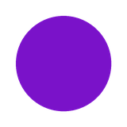</td>
<td align="center">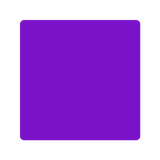</td>
<td align="center">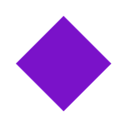</td>
<td align="center">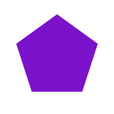</td>
</tr>
<tr>
<td align="center">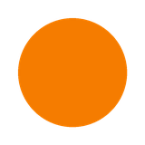</td>
<td align="center">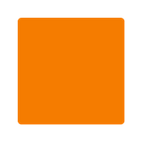</td>
<td align="center">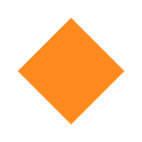</td>
<td align="center">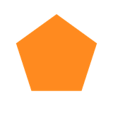</td>
</tr>
<tr>
<td align="center" colspan="4"><em>violet / orange (feature block) — color is present but task-irrelevant</em></td>
</tr>
</table>

### Conjunctive block — 2 dedicated shapes

<table>
<tr>
<td align="center">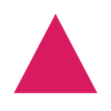</td>
<td align="center"></td>
</tr>
<tr>
<td align="center">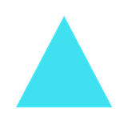</td>
<td align="center">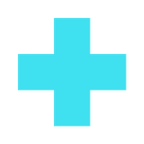</td>
</tr>
<tr>
<td align="center"><strong>triangle</strong></td>
<td align="center"><strong>cross</strong></td>
</tr>
<tr>
<td align="center" colspan="2"><em>pink / blue — both shape AND color determine the response (XOR rule); these colors, like the shapes, never appear in the other blocks</em></td>
</tr>
</table>

These shapes appear **only** in the conjunctive block and **never** in plain or
feature. As with every block's dedicated shape set, this ensures the
(shape, color) AND-binding is learned fresh — there is no prior shape→key code
to override or interfere with.

### Color palette

| Name    | Hex       | Block       |
| ------- | --------- | ----------- |
| violet  | `#7A12C9` | feature     |
| orange  | `#FF8A1F` | feature     |
| pink    | `#FF4D9E` | conjunctive |
| blue    | `#3FE0F0` | conjunctive |
| neutral | `#e8e8e8` | plain       |

Red, yellow, and green are excluded everywhere because of their stop/go
associations. The conjunctive "blue" is a light cyan hue (`#3FE0F0`); no
darker blue appears anywhere else in the palette, so it has no
within-category neighbor ("two kinds of blue"). In all participant-facing
text and in the data it is labeled simply **blue** (image files keep their
original `*_cyan.png` names). The four hues were selected by maximizing the
worst-case pairwise CIELAB ΔE across normal vision and simulated
protanopia/deuteranopia/tritanopia (Machado et al., 2009): min-pair
ΔE = 71 (normal), 34 (protan), 30 (deutan), 22 (tritan), on the task's
`#707070` background. The set spreads colors in both hue and lightness, so
pairs remain separable under any single dichromacy.

## Block conditions

Each participant runs **three within-subjects blocks**, one per condition. Every
block has a **distinct shape set**, so the three conditions are fully
independent — no shape (and therefore no shape→key code) is ever shared across
blocks:

- **plain** — hourglass, moon, teardrop, heart in neutral color; respond based
  on shape. Equivalent to the original simple stop task.
- **feature** — circle, square, diamond, pentagon in violet or orange; color is
  task-irrelevant; respond based on shape (color is a perceptual distractor).
- **conjunctive** — triangle and cross in pink or blue. Both shape AND
  color determine the correct key (XOR-like mapping). Because both the shapes
  and the colors are novel, the AND-binding cost is isolated from any proactive
  interference with a previously learned shape→key or color code.

Because each block introduces its own shapes, moving from one condition to the
next never lets a previously learned shape→key mapping carry over (earlier
versions deliberately shared the plain/feature shapes to avoid relearning; that
was dropped in favor of complete block independence).

## Key mapping: 4→2 pairing (plain and feature)

In each of the plain and feature blocks the 4 shapes are split into two pairs,
each pair mapped to one response key (comma `,` or period `.`). The plain and
feature blocks now use **different shape sets and independent pairings**.

**Pairing 1 is the primary (design-intended) grouping** — each less-common shape
is paired with a more common one — and is the grouping used at `group_index = 1`:

| Block   | `,` (comma) group   | `.` (period) group  |
| ------- | ------------------- | ------------------- |
| plain   | heart, moon         | hourglass, teardrop |
| feature | circle, diamond     | square, pentagon    |

The two remaining disjoint partitions of each set are retained only to fill the
`pairingIdx` counterbalancing dimension:

| Pairing | Plain `,` / `.`                        | Feature `,` / `.`                    |
| ------- | -------------------------------------- | ------------------------------------ |
| 1       | heart, moon / hourglass, teardrop      | circle, diamond / square, pentagon   |
| 2       | hourglass, moon / teardrop, heart      | circle, square / diamond, pentagon   |
| 3       | hourglass, heart / moon, teardrop      | circle, pentagon / square, diamond   |

The pairing index is fixed for a participant's whole session, but plain and
feature are otherwise independent conditions with their own shapes. (The comma
vs. period assignment shown above is for `keyConfigIdx = 0`; it flips for
`keyConfigIdx = 1`.)

> **Note:** because `pairingIdx` still counterbalances across all three
> partitions, only participants with `pairingIdx = 0` (`group_index` 1–12) get
> the intended "uncommon + common" Pairing 1. If every participant should get
> Pairing 1, collapse to a single fixed pairing and drop the `pairingIdx`
> dimension (36 → 12 cells).

### Conjunctive key mapping

Triangle and cross use the same two keys (`,` / `.`) but with an XOR-like rule:

| Stimulus          | Key   |
| ----------------- | ----- |
| pink triangle     | `,`   |
| blue triangle     | `.`   |
| pink cross        | `.`   |
| blue cross        | `,`   |

(Flipped when `keyConfigIdx = 1`.)

## Counterbalancing (`group_index` 1–36)

`group_index` is the single dial that determines block order, key assignment,
and shape pairing. 36 cells = 6 block orders × 2 key configs × 3 pairings.

| Component       | Formula                                    | Range |
| --------------- | ------------------------------------------ | ----- |
| blockOrderIdx   | `(gi − 1) % 6`                            | 0–5   |
| keyConfigIdx    | `⌊(gi − 1) / 6⌋ % 2`                     | 0–1   |
| pairingIdx      | `⌊(gi − 1) / 12⌋ % 3`                    | 0–2   |

`pairingIdx` selects one of the three disjoint partitions **for each block's own
shape set** (plain and feature are partitioned independently; see
[Key mapping](#key-mapping-42-pairing-plain-and-feature)).

Saved per trial (counterbalancing): `group_index`, `block_order_idx`,
`key_config_idx`, `pairing_idx`, `feature_shape_pairing`
(e.g. `"circle+diamond_vs_square+pentagon"`), `plain_shape_pairing`
(e.g. `"heart+moon_vs_hourglass+teardrop"`), `shape_pairing` (backward-compat
alias of `feature_shape_pairing`), `conj_shapes` (`"triangle+cross"`),
`conj_colors` (`"pink+blue"`), `block_order`. Because plain and feature use
independent pairings, **both** are recorded so each block's grouping is
recoverable.

Saved per trial (task): `block_condition`, `stim`, `color`, `condition`
(`go`/`stop`), `correct_response`, `correct_trial`, `response`, `rt`, `SSD`,
`block_num`, `exp_stage` (`practice`/`test`), and `practice_phase`
(`no_stop` / `with_stop` during practice; `null` in the test).

## Timeline per block

For each block in `blockOrder`:

Every block — plain, feature, and conjunctive — uses the **same two-phase
practice structure**; the stop signal is never mentioned until the participant
has learned the shape→key binding.

1. setup callback (sets `currentBlockCondition`, rebuilds `keyMap`, prompts, and
   instructions; resets practice/test counters and SSD). The star rule is
   suppressed (`includeStopRule = false`).
2. block-specific instructions: rule page (+ visual stim→key mapping panel) and
   a short "we'll start with a practice round" page. **No stop-signal page yet.**
3. **Phase 1 — go-only practice** (`goPhaseNode`, `createGoRound`):
   `practicePhaseLen` (12) go trials, no stop signals. Loops until go-accuracy
   exceeds `practiceAccuracyThresh` (0.75) or `practiceThresh` (3) rounds.
   Trials tagged `practice_phase = "no_stop"`.
4. **Stop-signal instructions** (`stopInstructNode`, withhold-your-response
   page). `includeStopRule` flips to `true` and prompts are rebuilt so the
   "Do not respond if a star appears" reminder appears from here on.
5. **Phase 2 — practice with stop signals** (`stopPhaseNode`, `createStopRound`):
   `practicePhaseLen` (12) trials, ~1/3 stop. Loops on the same 0.75 gate /
   `practiceThresh`. Trials tagged `practice_phase = "with_stop"`. The loop
   counter is reset between phases so each phase gets its own up-to-3 cap.
6. **Test**: `numTestBlocks` (3) test blocks of `numTrialsPerBlock` (60) trials
   each, ~1/3 stop (20 stop/block) → 180 test / 60 stop trials per condition.
7. between-block feedback (or end-of-task message after the final block).

## Trial structure

| Event    | Duration (ms)                                           |
| -------- | ------------------------------------------------------- |
| Fixation | 500                                                     |
| Probe    | 1500 (1000 ms stimulus presentation, 500 ms blank)      |
| ITI      | 500 (mean), 0 (min), 5000 (max)                         |

## Blocks

Per block condition (plain / feature / conjunctive):

| Phase           | Rounds        | Trials per round | Stop trials    |
| --------------- | ------------- | ---------------- | -------------- |
| Practice go     | up to 3 (loop) | 12 (go only)    | 0              |
| Practice stop   | up to 3 (loop) | 12              | ~4 (⅓)         |
| Test            | 3             | 60               | 20 (⅓)         |

Test totals per condition: **180 test trials, 60 stop trials** (matching
experiments 1–3).

## Conditions and probabilities

| Condition | Probability |
| --------- | ----------- |
| Go        | 66.66%      |
| Stop      | 33.33%      |

## Repo layout

```
feature_stop_task/   # experiment dir: config.json + experiment.js + style.css + images/
index.html           # local-test runner that loads from feature_stop_task/
README.md
```

The experiment files live in the `feature_stop_task/` subfolder so that
[expfactory-deploy](https://github.com/poldracklab/expfactory-deploy) discovers
the task. `config.json` and `index.html` cannot share a folder, so the
local-test runner stays at the repo root.

## Local preview

```bash
python3 -m http.server 8786
```

Open `http://localhost:8786/`. Defaults to a full 3-block session counterbalanced
by `group_index=1`. To pilot a single block in isolation, pick one from the
dropdown or pass `?task_type=plain|feature|conjunctive` in the URL. The launcher
shows a live mapping table that updates as you change `group_index`.

---

## Task instructions (participant-facing)

### Enable fullscreen

> The experiment will switch to full screen mode when you press the button below.

The stop-signal (star) instructions are shown **between** the two practice
phases, after the participant has learned the shape→key binding — not up front.

### Welcome screen

> Welcome! This experiment will take around 50 minutes. To avoid technical
> issues, please keep the experiment tab (on Chrome or Firefox) active and in
> fullscreen mode for the whole duration of each task. Press enter to begin.

### Page 1: rule page (per block)

> Place your index finger on the comma key (,) and your middle finger on the
> period key (.).
>
> During this task, on each trial, you will see shapes appear on the screen one
> at a time. [block-specific shape→key rule + visual SVG mapping panel]

(Shape→key rules are generated dynamically per block. No star mention yet.)

### Page 2: practice intro

> We'll start with a practice round to learn the rules for this block. During
> practice, you will receive feedback and a reminder of the rules. These will be
> taken out for the test, so make sure you understand the instructions before
> moving on.
>
> Try to respond as quickly and accurately as possible.

*→ Phase 1: go-only practice runs here (loops to proficiency).*

### Page 3: stop-signal instructions (after go practice)

> From now on, on some trials a star will appear around the shape, with or
> shortly after the shape appears.
>
> If you see the star, please try your best to withhold your response on that
> trial.
>
> If the star appears and you try your best to withhold your response, you will
> find that you will be able to stop sometimes, but not always.
>
> Please do not slow down your responses in order to wait for the star. It is
> equally important to respond quickly on trials without the star as it is to
> stop on trials with the star.

*→ Phase 2: practice with stop signals runs here, then the test.*
