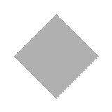
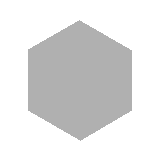
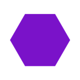
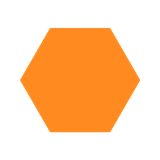

# Feature Stop Task

Adapted from `experiment_3_task/simple_stop_signal_e3/`. Tests the interaction
between response inhibition (stop-signal paradigm) and three levels of
stimulus-response binding complexity.

## Stimuli

All shapes are rendered as inline SVG (resolution-independent, colored
dynamically per trial). Each fits a 160×160 viewBox with a ~120-px visual
footprint.

### Plain & Feature blocks — 4 base shapes

<table>
<tr>
<td align="center"><strong>circle</strong><br></td>
<td align="center"><strong>square</strong><br></td>
<td align="center"><strong>diamond</strong><br></td>
<td align="center"><strong>hexagon</strong><br></td>
</tr>
<tr>
<td align="center" colspan="4"><em>neutral (plain block)</em></td>
</tr>
</table>

<table>
<tr>
<td align="center"></td>
<td align="center"></td>
<td align="center"></td>
<td align="center"></td>
</tr>
<tr>
<td align="center"></td>
<td align="center"></td>
<td align="center"></td>
<td align="center"></td>
</tr>
<tr>
<td align="center" colspan="4"><em>violet / orange (feature block) — color is present but task-irrelevant</em></td>
</tr>
</table>

### Conjunctive block — 2 dedicated shapes

<table>
<tr>
<td align="center"></td>
<td align="center"></td>
</tr>
<tr>
<td align="center"></td>
<td align="center"></td>
</tr>
<tr>
<td align="center"><strong>triangle</strong></td>
<td align="center"><strong>cross</strong></td>
</tr>
<tr>
<td align="center" colspan="2"><em>pink / cyan — both shape AND color determine the response (XOR rule); these colors, like the shapes, never appear in the other blocks</em></td>
</tr>
</table>

These shapes appear **only** in the conjunctive block and **never** in plain or
feature. This ensures the (shape, color) AND-binding is learned fresh — there is
no prior shape→key code to override or interfere with.

### Color palette

| Name    | Hex       | Block       |
| ------- | --------- | ----------- |
| violet  | `#7A12C9` | feature     |
| orange  | `#FF8A1F` | feature     |
| pink    | `#FF4D9E` | conjunctive |
| cyan    | `#3FE0F0` | conjunctive |
| neutral | `#e8e8e8` | plain       |

Red, yellow, and green are excluded everywhere because of their stop/go
associations; blue is excluded so cyan has no within-category neighbor
("two kinds of blue"). The four hues were selected by maximizing the
worst-case pairwise CIELAB ΔE across normal vision and simulated
protanopia/deuteranopia/tritanopia (Machado et al., 2009): min-pair
ΔE = 71 (normal), 34 (protan), 30 (deutan), 22 (tritan), on the task's
`#707070` background. The set spreads colors in both hue and lightness, so
pairs remain separable under any single dichromacy.

## Block conditions

Each participant runs **three within-subjects blocks**, one per condition:

- **plain** — 4 base shapes, neutral color; respond based on shape.
  Equivalent to the original simple stop task.
- **feature** — 4 base shapes in violet or orange; color is task-irrelevant;
  respond based on shape (color is a perceptual distractor). Same shape→key
  map as plain.
- **conjunctive** — triangle and cross in pink or cyan. Both shape AND
  color determine the correct key (XOR-like mapping). Because both the shapes
  and the colors are novel (never seen in plain/feature), the AND-binding cost
  is isolated from any proactive interference with the 4-shape→2-key mapping
  or the violet/orange color code learned earlier.

## Key mapping: 4→2 pairing (plain & feature)

The 4 base shapes are split into two pairs, each pair mapped to one response
key (comma `,` or period `.`). Three disjoint pairings are counterbalanced
across participants:

| Pairing | Key A shapes         | Key B shapes          |
| ------- | -------------------- | --------------------- |
| 1       | circle, square       | diamond, hexagon      |
| 2       | circle, diamond      | square, hexagon       |
| 3       | circle, hexagon      | square, diamond       |

The pairing is **fixed for the entire session**: a participant sees the same
shape→key binding in both the plain and feature blocks.

### Conjunctive key mapping

Triangle and cross use the same two keys (`,` / `.`) but with an XOR-like rule:

| Stimulus          | Key   |
| ----------------- | ----- |
| pink triangle     | `,`   |
| cyan triangle     | `.`   |
| pink cross        | `.`   |
| cyan cross        | `,`   |

(Flipped when `keyConfigIdx = 1`.)

## Counterbalancing (`group_index` 1–36)

`group_index` is the single dial that determines block order, key assignment,
and shape pairing. 36 cells = 6 block orders × 2 key configs × 3 pairings.

| Component       | Formula                                    | Range |
| --------------- | ------------------------------------------ | ----- |
| blockOrderIdx   | `(gi − 1) % 6`                            | 0–5   |
| keyConfigIdx    | `⌊(gi − 1) / 6⌋ % 2`                     | 0–1   |
| pairingIdx      | `⌊(gi − 1) / 12⌋ % 3`                    | 0–2   |

Saved per trial: `group_index`, `block_order_idx`, `key_config_idx`,
`pairing_idx`, `shape_pairing` (e.g. `"circle+square_vs_diamond+hexagon"`),
`conj_shapes` (`"triangle+cross"`), `conj_colors` (`"pink+cyan"`),
`block_condition`, `block_order`.

## Timeline per block

For each block in `blockOrder`:

1. setup callback (sets `currentBlockCondition`, rebuilds `keyMap`, prompts, and
   instructions; resets practice/test counters and SSD)
2. block-specific instructions (rule + visual stim→key mapping panel +
   stop-signal explanation + practice intro)
3. per-block practice
   - **plain / feature**: standard 24-trial balanced practice (`practiceLen`),
     looping until accuracy threshold or `practiceThresh`. The block
     instructions include the stop-signal (star) page up front.
   - **conjunctive**: a structured sequence of 12-trial rounds
     (`conjPracticeLen`); the star is not mentioned until step (c):
     1. **Mandatory round 1, no stop signals** (`createConjGoRound1`): the two
        (shape, color) combos mapped to the comma key, then the two mapped to
        the period key, then the remaining 8 go trials shuffled.
     2. **Mandatory round 2, no stop signals** (`createConjGoRound2`): 12
        fully shuffled go trials.
     3. **Stop-signal instructions** (withhold-your-response page), shown only
        now; the "Do not respond if a star appears" prompt line also appears
        from this point on.
     4. **Looped practice with stop signals** (`createConjStopRound`): 12
        randomly sampled trials with ~1/3 stop trials, looping until go
        accuracy exceeds `conjPracticeAccuracyThresh` (0.55 — experiment 2's
        go-accuracy inclusion bar) or `practiceThresh` (3) rounds. Plain and
        feature practice keeps the stricter 0.75 gate.
     Practice trials carry a `practice_phase` data field
     (`no_stop_ordered` / `no_stop_shuffled` / `with_stop`; null in
     plain/feature).
4. one test block (72 trials, 33% stop)
5. between-block feedback (or end-of-task message after the final block)

## Trial structure

| Event    | Duration (ms)                                           |
| -------- | ------------------------------------------------------- |
| Fixation | 500                                                     |
| Probe    | 1500 (1000 ms stimulus presentation, 500 ms blank)      |
| ITI      | 500 (mean), 0 (min), 5000 (max)                         |

## Blocks

| Block type | Number of blocks | Trials per block |
| ---------- | ---------------- | ---------------- |
| Test       | 3                | 72               |

## Conditions and probabilities

| Condition | Probability |
| --------- | ----------- |
| Go        | 66.66%      |
| Stop      | 33.33%      |

## Repo layout

```
feature_stop_task/   # experiment dir: config.json + experiment.js + style.css + images/
index.html           # local-test runner that loads from feature_stop_task/
README.md
```

The experiment files live in the `feature_stop_task/` subfolder so that
[expfactory-deploy](https://github.com/poldracklab/expfactory-deploy) discovers
the task. `config.json` and `index.html` cannot share a folder, so the
local-test runner stays at the repo root.

## Local preview

```bash
python3 -m http.server 8786
```

Open `http://localhost:8786/`. Defaults to a full 3-block session counterbalanced
by `group_index=1`. To pilot a single block in isolation, pick one from the
dropdown or pass `?task_type=plain|feature|conjunctive` in the URL. The launcher
shows a live mapping table that updates as you change `group_index`.

---

## Task instructions (participant-facing)

### Enable fullscreen

> The experiment will switch to full screen mode when you press the button below.

### Welcome screen

> Welcome! This experiment will take around 10 to 15 minutes. To avoid technical
> issues, please keep the experiment tab (on Chrome or Firefox) active and in
> fullscreen mode for the whole duration of each task. Press enter to begin.

### Page 1: key placement

> Place your index finger on the comma key (,) and your middle finger on the
> period key (.).
>
> During this task, on each trial, you will see shapes appear on the screen one
> at a time.

(Shape→key rules are generated dynamically per block, including visual SVG
mapping panels.)

### Page 2: stop signal

> On some trials, a star will appear around the shape, shortly after the shape
> appears.
>
> If you see the star, please try your best to withhold your response on that
> trial.
>
> If the star appears and you try your best to withhold your response, you will
> find that you will be able to stop sometimes, but not always.
>
> Please do not slow down your responses in order to wait for the star. It is
> equally important to respond quickly on trials without the star as it is to
> stop on trials with the star.

### Page 3: practice intro

> We'll start with a practice round. During practice, you will receive feedback
> and a reminder of the rules. These will be taken out for the test, so make
> sure you understand the instructions before moving on.
>
> Try to respond as quickly and accurately as possible.

### Page 4: start practice

> Press enter to begin practice.
